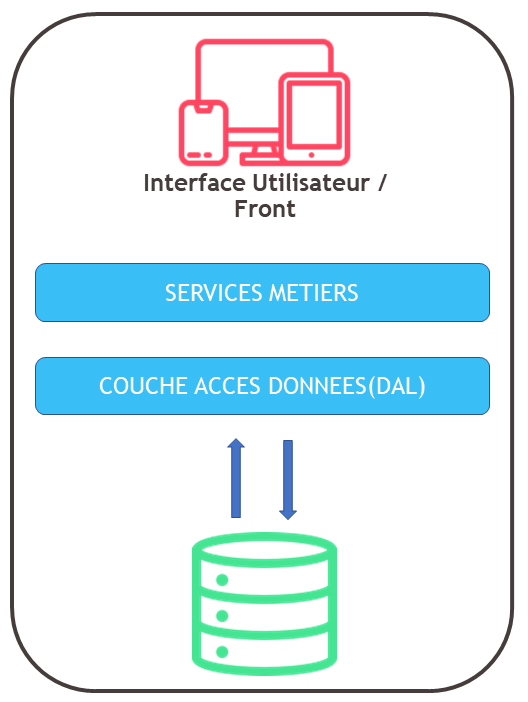

# Architecture Monolithique

## Objectifs de cette section

Dans cette section, nous allons explorer le modèle **monolithique**, qui est la forme la plus simple d’architecture
applicative.  
À la fin de cette section, vous serez capable de :

- Définir ce qu’est une **application monolithique**.
- Identifier ses **avantages et inconvénients**.
- Comprendre son **fonctionnement et ses limites**.
- Mettre en place une **application backend monolithique en PHP et Node.js**.
- Déterminer les **implications en infrastructure** et préparer son **hébergement et sa maintenance**.

---

## 1. Qu’est-ce qu’une architecture monolithique ?

Une **application monolithique** est un **bloc unique**, où toutes les fonctionnalités (interface utilisateur, logique
métier, accès aux données) sont **regroupées dans un seul codebase et exécutées sur un même serveur**.

### Caractéristiques principales

- Une seule application contenant **toutes les fonctionnalités**.
- Une **base de données centralisée**.
- Une **exécution sur un seul serveur ou une seule machine virtuelle**.

### Schéma d’une architecture monolithique :



---

## 2. Avantages et Inconvénients du monolithique

| **Aspect**        | **Avantages**                                      | **Inconvénients**                                    |
|-------------------|----------------------------------------------------|------------------------------------------------------|
| **Développement** | Facile à mettre en place et à comprendre           | Peut devenir difficile à maintenir sur le long terme |
| **Performance**   | Pas de communication réseau entre les composants   | Difficulté à monter en charge                        |
| **Déploiement**   | Une seule unité à gérer                            | Impossible de déployer certaines parties séparément  |
| **Évolutivité**   | Simple pour les petits projets                     | Peu adapté aux grandes applications                  |
| **Sécurité**      | Moins de points d’entrée = moins de vulnérabilités | Un bug critique peut affecter tout le système        |

---

## 3. Mise en place d’un backend monolithique

Nous allons maintenant créer une **application de gestion de tâches** en **architecture monolithique**.  
Cette application comprendra une API REST permettant d’ajouter, modifier et supprimer des tâches dans une **base de
données locale**.

**Les technologies utilisées :**

- **PHP + SQLite** pour la version PHP.
- **Node.js + SQLite** pour la version JavaScript.

---

### Arborescence du projet à modifier par les développeurs

```bash
/gestion-taches
├── /php                   # Implémentation en PHP
│   ├── index.php          # Point d'entrée
│   ├── db.php             # Connexion à la base de données
│   ├── Task.php           # Modèle Task
│   ├── taskController.php # Contrôleur des tâches
│   ├── api.php            # API REST pour gérer les tâches
│   ├── .env               # Configuration de la base de données
│   ├── composer.json      # Dépendances PHP
│
├── /nodejs                # Implémentation en Node.js
│   ├── index.js           # Point d'entrée
│   ├── db.js              # Connexion à la base de données
│   ├── task.js            # Modèle Task
│   ├── taskController.js  # Contrôleur des tâches
│   ├── api.js             # API REST pour gérer les tâches
│   ├── .env               # Configuration de la base de données
│   ├── package.json       # Dépendances Node.js
│
└── README.md              # Documentation
```

---

## 4. Mise en pratique pour les administrateurs infrastructure

En plus du développement du backend, les administrateurs système devront analyser l’**hébergement et la gestion d’un
monolithe**.

### Identification des composants techniques

**Objectif :**  
Analyser l’architecture et les services nécessaires.

- Quels sont les **composants techniques** du projet ?
- Quels services doivent être installés et configurés sur le serveur ?
- Quelle est la **configuration minimale requise** pour héberger l’application ?

**Livrable attendu** : Un schéma des composants avec une description de leur rôle.

---

### Hébergement et installation

**Objectif :**  
Déterminer comment et où héberger l’application.

- Faut-il utiliser un **serveur physique, un VPS, un hébergement mutualisé, ou un hébergement cloud** ?
- Quels outils doivent être installés sur le serveur pour PHP et pour Node.js ?
- Faut-il prévoir un **serveur unique ou plusieurs instances** ?

**Livrable attendu** : Un plan d’installation détaillé pour PHP et Node.js.

---

### Sauvegardes et maintenance

**Objectif :**  
Prévoir une stratégie de sauvegarde et de mise à jour.

- Quels fichiers et bases de données doivent être sauvegardés ?
- Quelle fréquence de sauvegarde recommander ?
- Comment gérer les **mises à jour du code et des dépendances** ?

**Livrable attendu** : Une proposition de stratégie de sauvegarde.

---

### Sécurité et monitoring

**Objectif :**  
Sécuriser l’application et surveiller ses performances.

- Quels ports doivent être ouverts et quels services doivent être protégés ?
- Comment configurer **un pare-feu et un accès SSH sécurisé** ?
- Quels outils utiliser pour surveiller **l’état du serveur et la consommation des ressources** ?

**Livrable attendu** : Une check-list des mesures de sécurité à appliquer.
