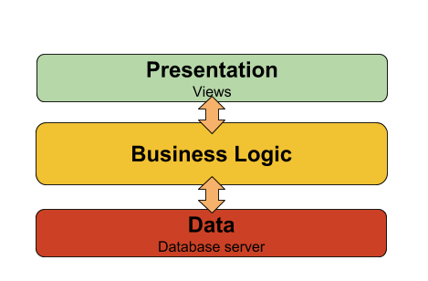
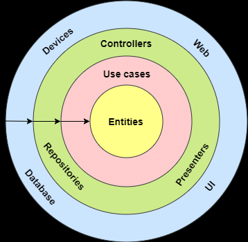

# Architecture N-Tiers

## Objectifs de cette section

Dans cette section, nous allons explorer le modèle **n-tiers**, qui permet de mieux organiser une application en
séparant ses différentes responsabilités.  
À la fin de cette section, vous serez capable de :

- Définir ce qu’est une **architecture n-tiers**.
- Comprendre les bénéfices de la **séparation des couches**.
- Identifier les **avantages et inconvénients** de ce modèle.
- Mettre en place une **application backend n-tiers en PHP et Node.js**.
- Anticiper les **implications en infrastructure** et organiser le déploiement.

---

## 1. Qu’est-ce qu’une architecture n-tiers ?

L’architecture **n-tiers** est une approche qui **découpe une application en plusieurs couches**, où chaque couche a une
responsabilité bien définie.

### Caractéristiques principales

- Séparation de l’application en **plusieurs couches distinctes**.
- Meilleure organisation du code, facilitant la **maintenance et l’évolution**.
- Possibilité d’héberger **chaque couche sur un serveur différent**.

### Les couches principales d’une architecture 3-tiers

- **Tier Présentation** (Frontend) → Interface utilisateur (navigateur, application mobile, etc.).
- **Tier Métier** (Backend) → Contient la logique de l’application (API REST, contrôleurs, services…).
- **Tier Données** (Base de données) → Stockage des informations et interactions avec les données.

### Schéma d’une architecture 3-tiers :



### Schéma général d’une architecture en couche :



---

## 2. Avantages et Inconvénients du n-tiers

| **Aspect**        | **Avantages**                                      | **Inconvénients**                                              |
|-------------------|----------------------------------------------------|----------------------------------------------------------------|
| **Développement** | Organisation claire du code                        | Complexité plus élevée que le monolithique                     |
| **Performance**   | Peut répartir la charge entre plusieurs serveurs   | Peut nécessiter une communication réseau supplémentaire        |
| **Déploiement**   | Chaque couche peut être mise à jour indépendamment | Nécessite une gestion de version et d'intégration plus stricte |
| **Évolutivité**   | Facilite l'ajout de nouvelles fonctionnalités      | Peut être plus difficile à configurer et maintenir             |
| **Sécurité**      | Limite les accès directs aux données               | Plus de points d'entrée à sécuriser                            |

---

## 3. Mise en place d’un backend n-tiers

Nous allons maintenant créer une **application de gestion de tâches** en **architecture n-tiers**.  
Cette application suivra un découpage en **trois couches principales** :

### Arborescence du projet à modifier par les développeurs

```bash
/gestion-taches-n-tiers
├── /php                   # Version PHP du backend
│   ├── /presentation      # Couche Présentation (API exposée)
│   │   ├── api.php        # Point d'entrée de l'API REST
│   │   ├── routes.php     # Définition des routes API
│   │   ├── response.php   # Gestion des réponses JSON
│   │
│   ├── /metier            # Couche Métier (Logique applicative)
│   │   ├── TaskService.php # Contient les règles métier
│   │   ├── Validator.php  # Vérification des données
│   │
│   ├── /donnees           # Couche Données (Accès à la BDD)
│   │   ├── TaskRepository.php # Interaction avec la base
│   │   ├── db.php         # Connexion à la base de données
│   │
│   ├── config/            # Configuration générale
│   ├── database/          # Scripts de base de données
│   ├── composer.json      # Dépendances PHP
│
├── /nodejs                # Version Node.js du backend
│   ├── /presentation      # Couche Présentation (API exposée)
│   │   ├── api.js         # Point d'entrée de l'API REST
│   │   ├── routes.js      # Définition des routes API
│   │   ├── response.js    # Gestion des réponses JSON
│   │
│   ├── /metier            # Couche Métier (Logique applicative)
│   │   ├── taskService.js # Contient les règles métier
│   │   ├── validator.js   # Vérification des données
│   │
│   ├── /donnees           # Couche Données (Accès à la BDD)
│   │   ├── taskRepository.js # Interaction avec la base
│   │   ├── db.js          # Connexion à la base de données
│   │
│   ├── config/            # Configuration générale
│   ├── database/          # Scripts de base de données
│   ├── package.json       # Dépendances Node.js
│
└── README.md              # Documentation
```

---

## 4. Mise en pratique pour les administrateurs infrastructure

En plus du développement du backend, les administrateurs système devront analyser l’hébergement et la gestion d’un
backend n-tiers.

---

### Identification des composants techniques

**Objectif :**  
Analyser l’architecture et les services nécessaires.

- Quelles sont les **trois couches principales** du projet et leurs rôles respectifs ?
- Quels **services** doivent être installés et configurés sur les serveurs pour **chaque couche** ?
- Comment organiser la **communication entre les couches** pour assurer leur bon fonctionnement ?

**Livrable attendu** : Un **schéma des composants** avec une description de leur rôle et des interactions.

---

### Hébergement et répartition des services

**Objectif :**  
Déterminer **comment et où** héberger chaque couche du backend.

- Faut-il héberger les **trois tiers sur un même serveur** ou les séparer ?
- Quelles sont les **différences entre un hébergement monolithique et un hébergement n-tiers** ?
- Comment choisir entre un **serveur VPS, dédié ou cloud** pour chaque couche ?

**Livrable attendu** : Un **plan d’hébergement détaillé** avec la répartition des services.

---

### Gestion des bases de données et sauvegardes

**Objectif :**  
Mettre en place une **stratégie de gestion et de sauvegarde des données**.

- Quels sont les **risques de perte de données** dans une architecture n-tiers ?
- Comment **automatiser les sauvegardes** des bases de données ?
- Quelle stratégie utiliser pour assurer **la synchronisation entre plusieurs serveurs de base de données** ?

**Livrable attendu** : Une **stratégie de sauvegarde et de réplication** des bases de données.

---

### Sécurisation de l’architecture n-tiers

**Objectif :**  
Assurer la **protection et le bon fonctionnement** des différents tiers.

- Comment **limiter l’accès aux bases de données** depuis l’extérieur ?
- Comment **sécuriser la communication** entre les couches backend et base de données ?
- Quels **outils peuvent être utilisés** pour monitorer les performances et détecter les erreurs ?

**Livrable attendu** : Une **check-list des mesures de sécurité** adaptées à une architecture n-tiers.
