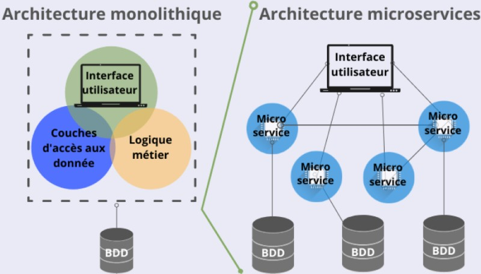

# Architecture Microservices

## Objectifs de cette section

Dans cette section, nous allons explorer le modèle **microservices**, une approche qui permet de découper une
application en plusieurs services indépendants.  
À la fin de cette section, vous serez capable de :

- Définir ce qu’est une **architecture microservices**.
- Comprendre ses **principes, avantages et inconvénients**.
- Identifier les **différences avec l’architecture monolithique et n-tiers**.
- Mettre en place une **application backend en microservices avec PHP et Node.js**.
- Analyser les **implications en infrastructure** et organiser le déploiement.

---

## 1. Qu’est-ce qu’une architecture microservices ?

L’architecture **microservices** repose sur le principe de **diviser une application en plusieurs services autonomes**,
où chaque service est responsable d’une tâche spécifique.

**Chaque microservice fonctionne indépendamment**, possède **sa propre base de données**, et communique avec les autres
via des **API REST ou des messages asynchrones**.

### Caractéristiques principales

- Découpage de l’application en **petits services spécialisés**.
- **Autonomie des services** : chaque microservice peut être développé, déployé et mis à jour indépendamment.
- Communication entre services via **API REST, gRPC, ou file de messages** (**RabbitMQ, Kafka**).
- **Hétérogénéité technologique** : chaque service peut être écrit dans un langage différent.

### Exemple concret :

Une application de gestion de tâches peut être divisée en trois microservices :

- **Microservice Utilisateurs** → Gestion des comptes et authentification.
- **Microservice Tâches** → Création, modification et suppression des tâches.
- **Microservice Notifications** → Envoi d’e-mails ou de notifications.

### Schéma d’une architecture 3-tiers :



### [Exemple de projet réalisé en microservices](https://github.com/nicolasvauche/microservices-project)

---

## 2. Différences entre microservices, monolithique et n-tiers

| **Aspect**       | **Monolithique**          | **N-Tiers**                    | **Microservices**                                |
|------------------|---------------------------|--------------------------------|--------------------------------------------------|
| **Architecture** | Tout en un seul bloc      | Séparation en couches          | Services indépendants                            |
| **Scalabilité**  | Complexe                  | Modérée                        | Excellente                                       |
| **Déploiement**  | Tout doit être mis à jour | Déploiement par couche         | Déploiement indépendant des services             |
| **Maintenance**  | Peut devenir difficile    | Modulaire                      | Chaque service peut évoluer séparément           |
| **Sécurité**     | Moins de points d’entrée  | Sécurité au niveau des couches | Sécurité distribuée (plus de surfaces d’attaque) |

---

## 3. Avantages et inconvénients des microservices

| **Aspect**      | **Avantages**                                                     | **Inconvénients**                                    |
|-----------------|-------------------------------------------------------------------|------------------------------------------------------|
| **Flexibilité** | Chaque microservice peut être développé dans un langage différent | Complexité accrue dans la communication des services |
| **Évolutivité** | Facile d’ajouter de nouveaux services                             | Peut devenir difficile à gérer à grande échelle      |
| **Scalabilité** | Chaque service peut être mis à l’échelle indépendamment           | Plus de besoins en monitoring                        |
| **Déploiement** | Mise à jour et déploiement indépendants                           | Gestion du CI/CD plus complexe                       |
| **Performance** | Permet d'optimiser certaines parties de l'application             | Peut entraîner des latences réseau                   |

---

## 4. Mise en place d’un backend en microservices

Nous allons maintenant créer une **application de gestion de tâches** en **architecture microservices**.  
Chaque service sera indépendant et communiquera avec les autres via **API REST**.

### Arborescence du projet à modifier par les développeurs

```bash
/gestion-taches-microservices
├── /php                           # Version PHP des microservices
│   ├── /services                  # Chaque microservice est indépendant
│   │   ├── users/                  # Microservice Utilisateurs
│   │   │   ├── public/             # API exposée
│   │   │   ├── src/                # Code source
│   │   │   ├── config/             # Configuration spécifique
│   │   │   ├── database/           # Gestion de la base de données
│   │   │   ├── composer.json       # Dépendances PHP
│   │   │   └── README.md           # Documentation
│   │   ├── tasks/                  # Microservice Tâches
│   │   │   ├── public/             
│   │   │   ├── src/                
│   │   │   ├── config/             
│   │   │   ├── database/           
│   │   │   ├── composer.json       
│   │   │   └── README.md           
│   │   ├── notifications/          # Microservice Notifications
│   │   │   ├── public/             
│   │   │   ├── src/                
│   │   │   ├── config/             
│   │   │   ├── database/           
│   │   │   ├── composer.json       
│   │   │   └── README.md           
│   ├── /gateway                    # API Gateway pour centraliser les appels
│   │   ├── index.php               # Point d'entrée
│   │   ├── routes.php              # Définition des routes
│   │   ├── config/                 # Configuration
│   │   ├── composer.json           # Dépendances PHP
│   │   └── README.md               # Documentation
│   └── README.md                   # Documentation générale du projet
│
├── /nodejs                         # Version Node.js des microservices
│   ├── /services                   # Chaque microservice est indépendant
│   │   ├── users/                  # Microservice Utilisateurs
│   │   │   ├── src/                # Code source
│   │   │   ├── config/             # Configuration spécifique
│   │   │   ├── database/           # Gestion de la base de données
│   │   │   ├── package.json        # Dépendances Node.js
│   │   │   └── README.md           # Documentation
│   │   ├── tasks/                  # Microservice Tâches
│   │   │   ├── src/                
│   │   │   ├── config/             
│   │   │   ├── database/           
│   │   │   ├── package.json        
│   │   │   └── README.md           
│   │   ├── notifications/          # Microservice Notifications
│   │   │   ├── src/                
│   │   │   ├── config/             
│   │   │   ├── database/           
│   │   │   ├── package.json        
│   │   │   └── README.md           
│   ├── /gateway                    # API Gateway pour centraliser les appels
│   │   ├── index.js                # Point d'entrée
│   │   ├── routes.js               # Définition des routes
│   │   ├── config/                 # Configuration
│   │   ├── package.json            # Dépendances Node.js
│   │   └── README.md               # Documentation
│   └── README.md                   # Documentation générale du projet
```

---

## 5. Mise en pratique pour les administrateurs infrastructure

En plus du développement du backend, les administrateurs système devront analyser **l’hébergement et la gestion d’un
backend en microservices**.

### Identification des composants techniques

**Objectif :**  
Comprendre l’architecture et les services nécessaires.

- Quels sont les **microservices principaux** et leurs rôles respectifs ?
- Quels sont les **besoins en bases de données** pour chaque service ?
- Comment les microservices vont-ils **communiquer entre eux** (API REST, messagerie, etc.) ?

**Livrable attendu** : Un schéma des microservices avec leurs interactions.

---

### Hébergement et orchestration des microservices

**Objectif :**  
Déterminer **comment et où** héberger chaque service.

- Faut-il héberger tous les microservices sur un **même serveur** ou les répartir ?
- Comment gérer la **scalabilité** des microservices ?
- Quels outils peuvent être utilisés pour **orchestrer les services** ? (Ex : **Docker, Kubernetes, Docker Compose**)

**Livrable attendu** : Un plan détaillé sur l’organisation et l’orchestration des services.

---

### Gestion des bases de données et cohérence des données

**Objectif :**  
Maintenir une **cohérence des données** malgré la séparation des services.

- Chaque microservice doit-il avoir **sa propre base de données** ou partager une base commune ?
- Comment garantir la **consistance des données** entre plusieurs bases de données ?
- Faut-il mettre en place un **système d’événements** pour synchroniser les bases de données ?

**Livrable attendu** : Une stratégie de gestion des données adaptée à une architecture microservices.

---

### Sécurisation et monitoring des microservices

**Objectif :**  
Assurer la **sécurité et la surveillance** des services.

- Comment sécuriser les **communications entre microservices** ?
- Quels sont les risques de **faille de sécurité** dans une architecture distribuée ?
- Quels outils permettent de **monitorer l’état des services et détecter les erreurs** ? (Ex : **Prometheus, Grafana,
  ELK Stack**)

**Livrable attendu** : Une check-list des **bonnes pratiques de sécurité et de monitoring**.
