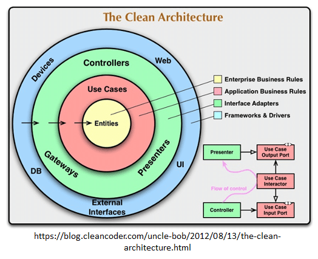

# Clean Architecture

## Objectifs de cette section

Dans cette section, nous allons explorer **l’Architecture Clean**, qui permet de **séparer strictement la logique métier
des dépendances externes**.  
À la fin de cette section, vous serez capable de :

- Comprendre **les principes fondamentaux de l’Architecture Clean**.
- Identifier les **différences avec les autres architectures**.
- Structurer une **application backend en Clean Architecture avec PHP et Node.js**.
- Analyser les **implications en infrastructure** et organiser le déploiement.

---

## 1. Qu’est-ce que la Clean Architecture ?

La **Clean Architecture** est une approche introduite par **Robert C. Martin (Uncle Bob)**, qui vise à **rendre le code
maintenable, testable et évolutif**.

**Son objectif principal :** **Séparer la logique métier des détails techniques**, pour que le cœur de l’application ne
dépende d’aucune technologie spécifique (framework, base de données…).

### **Principes clés**

- **Indépendance des frameworks** → L’application ne dépend pas d’un framework particulier.
- **Indépendance de la base de données** → Le stockage des données est interchangeable.
- **Indépendance de l’interface utilisateur** → L’application peut fonctionner avec une API REST, une interface web ou
  mobile.
- **Testabilité** → La logique métier peut être testée sans dépendre d’une base de données ou d’un serveur web.

**Exemple concret :**
Une application de gestion de tâches avec Clean Architecture serait organisée ainsi :

- **Le domaine métier** définit ce qu’est une **Tâche** (`Task`).
- **Les Cas d’Usage** (`UseCases`) décrivent ce que l’on peut faire avec (`Créer une tâche`, `Modifier une tâche`…).
- **Les Adaptateurs** (`Adapters`) permettent de **connecter l’application au monde extérieur** (API, base de données,
  fichiers…).
- **L’Infrastructure** contient **les détails techniques**, comme **la base de données ou les dépendances externes**.

---

## 2. Différences entre Clean Architecture et autres modèles

| **Aspect**       | **MVC/N-Tiers**                                                       | **Clean Architecture**                         |
|------------------|-----------------------------------------------------------------------|------------------------------------------------|
| **Organisation** | Basée sur des couches techniques (Frontend, Backend, Base de données) | Basée sur le métier et les cas d’usage         |
| **Dépendances**  | Le code métier dépend souvent du framework et de la base de données   | Le code métier est totalement indépendant      |
| **Évolutivité**  | Changements complexes car tout est lié                                | Plus modulaire et adaptable aux évolutions     |
| **Testabilité**  | Tests plus difficiles car le code métier dépend des technologies      | Tests faciles car la logique métier est isolée |

---

## 3. Les couches de la Clean Architecture

L'Architecture Clean est composée de **plusieurs couches concentriques**, où **les couches externes ne doivent jamais
impacter les couches internes**.

### **Les 4 couches principales :**

#### **Entités (Domain Layer)**

- Représentent les objets métier **sans dépendance** aux technologies externes.
- **Exemple :** Une **Tâche** (`Task`) a des propriétés (`titre`, `description`, `statut`).

#### **Cas d’Usage (Application Layer)**

- Contiennent la **logique métier** qui définit ce que l’on peut faire avec les entités.
- **Exemple :** Un **Service de gestion des tâches** (`TaskService`) qui permet de créer, modifier et supprimer une
  tâche.

#### **Adaptateurs (Interface Layer)**

- Connectent l’application au **monde extérieur** (API, fichiers, bases de données…).
- **Exemple :** Un **Controller API** qui reçoit une requête HTTP et appelle un Cas d’Usage.

#### **Infrastructure (External Layer)**

- Contient les **détails techniques** (Base de données, Frameworks, APIs externes).
- **Exemple :** Un **Repository** qui récupère les tâches depuis une base de données.

### **Schéma simplifié de la Clean Architecture :**



---

## 4. Mise en place d’un backend en Clean Architecture

Nous allons maintenant créer une **application de gestion de tâches** en **suivant les principes de la Clean
Architecture**.

```bash
/gestion-taches-clean-architecture
├── /php                           # Version PHP en Clean Architecture
│   ├── /src                       # Code source de l'application
│   │   ├── /Domain                # Cœur du métier (Entités et Règles Métier)
│   │   │   ├── Task/              # Vertical Slice "Tâches"
│   │   │   │   ├── Task.php       # Entité Métier
│   │   │   │   ├── TaskId.php     # Identifiant unique (Value Object)
│   │   │   │   ├── TaskStatus.php # Enumération des statuts
│   │   │   ├── User/              # Vertical Slice "Utilisateurs"
│   │   │   ├── Notification/      # Vertical Slice "Notifications"
│   │   ├── /Application           # Cas d'Usage (Services Métier)
│   │   │   ├── Task/              
│   │   │   │   ├── TaskService.php       # Service Métier pour les tâches
│   │   │   │   ├── CreateTaskHandler.php # Cas d'Usage : Création de tâche
│   │   │   │   ├── UpdateTaskHandler.php # Cas d'Usage : Mise à jour de tâche
│   │   │   │   ├── DeleteTaskHandler.php # Cas d'Usage : Suppression de tâche
│   │   ├── /Infrastructure        # Accès aux données et services externes
│   │   │   ├── Persistence/        # Stockage des données
│   │   │   │   ├── TaskRepository.php   # Implémentation du Repository
│   │   │   ├── Services/           # Services externes
│   │   │   │   ├── EmailNotifier.php    # Service de notification par email
│   │   │   ├── Config/             # Configuration de l'application
│   ├── /WebUI                      # Interface Utilisateur (API Web)
│   │   ├── /Http                   
│   │   │   ├── Controllers/        # Points d'entrée HTTP (API REST)
│   │   │   │   ├── TaskController.php  # Contrôleur des tâches
│   │   │   ├── Routes.php          # Définition des routes API
│   │   ├── /CLI                    # Interface en ligne de commande
│   │   │   ├── TaskCommands.php    # Commandes CLI pour gérer les tâches
│   ├── /config                     # Configuration générale
│   ├── /database                    # Migrations et Seeders
│   ├── public/                      # Point d’entrée de l’application
│   │   ├── index.php                 # Routeur principal
│   ├── composer.json                 # Dépendances PHP
│   └── README.md                     # Documentation
│
├── /nodejs                         # Version Node.js en Clean Architecture
│   ├── /src                        # Code source de l'application
│   │   ├── /Domain                 # Cœur du métier (Entités et Règles Métier)
│   │   │   ├── Task/               # Vertical Slice "Tâches"
│   │   │   │   ├── Task.ts         # Entité Métier
│   │   │   │   ├── TaskId.ts       # Identifiant unique (Value Object)
│   │   │   │   ├── TaskStatus.ts   # Enumération des statuts
│   │   │   ├── User/               # Vertical Slice "Utilisateurs"
│   │   │   ├── Notification/       # Vertical Slice "Notifications"
│   │   ├── /Application            # Cas d'Usage (Services Métier)
│   │   │   ├── Task/              
│   │   │   │   ├── TaskService.ts       # Service Métier pour les tâches
│   │   │   │   ├── CreateTaskHandler.ts # Cas d'Usage : Création de tâche
│   │   │   │   ├── UpdateTaskHandler.ts # Cas d'Usage : Mise à jour de tâche
│   │   │   │   ├── DeleteTaskHandler.ts # Cas d'Usage : Suppression de tâche
│   │   ├── /Infrastructure         # Accès aux données et services externes
│   │   │   ├── Persistence/         # Stockage des données
│   │   │   │   ├── TaskRepository.ts   # Implémentation du Repository
│   │   │   ├── Services/            # Services externes
│   │   │   │   ├── EmailNotifier.ts    # Service de notification par email
│   │   │   ├── Config/              # Configuration de l'application
│   ├── /WebUI                       # Interface Utilisateur (API Web)
│   │   ├── /Http                    
│   │   │   ├── Controllers/         # Points d'entrée HTTP (API REST)
│   │   │   │   ├── TaskController.ts  # Contrôleur des tâches
│   │   │   ├── Routes.ts            # Définition des routes API
│   │   ├── /CLI                     # Interface en ligne de commande
│   │   │   ├── TaskCommands.ts      # Commandes CLI pour gérer les tâches
│   ├── /config                      # Configuration générale
│   ├── /database                     # Migrations et Seeders
│   ├── public/                       # Point d’entrée de l’application
│   │   ├── index.ts                   # Routeur principal
│   ├── package.json                   # Dépendances Node.js
│   └── README.md                      # Documentation
```

---

## 5. Mise en pratique pour les administrateurs infrastructure

En plus du développement du backend, les administrateurs système devront analyser **l’hébergement et la gestion d’un
backend en Clean Architecture**.

### **5.1. Identification des composants techniques**

**Objectif :** Analyser les besoins d’une architecture en couches strictes.

- Comment s’assurer que chaque couche **reste indépendante** des autres ?
- Quels sont les services externes nécessaires (ex : **base de données, API, stockage**) ?
- Comment les données sont-elles **échangées entre les différentes couches** ?

**Livrable attendu** : Un **schéma des composants et des interactions**.

---

### **5.2. Hébergement et gestion des couches**

**Objectif :** Déterminer **comment héberger et organiser les différentes couches**.

- Où doivent être hébergées les **différentes couches** (Domaine, Cas d’Usage, Adaptateurs, Infrastructure) ?
- Comment s’assurer que la couche **Infrastructure** ne soit pas couplée à la couche Métier ?
- Quels outils peuvent être utilisés pour **optimiser le chargement et la communication entre les couches** ?

**Livrable attendu** : Un plan détaillé sur **l’hébergement et la répartition des composants**.

---

### **5.3. Gestion des données et cache**

**Objectif :** Assurer **une gestion efficace et performante des données**.

- Comment gérer **les accès aux bases de données sans exposer directement les entités** ?
- Quels systèmes de **cache** peuvent être utilisés pour améliorer la performance ?
- Comment limiter les **accès directs à la base de données** pour éviter des problèmes de scalabilité ?

**Livrable attendu** : Une stratégie de **gestion des bases de données et du cache**.

---

### **5.4. Sécurisation et monitoring d’une application en Clean Architecture**

**Objectif :** Assurer **la sécurité et la surveillance** d’un backend structuré en Clean Architecture.

- Comment garantir que **la couche Métier ne puisse pas être directement attaquée** ?
- Quels sont les risques liés à une **architecture trop modulaire** et comment les éviter ?
- Quels outils permettent de **monitorer l’état des services et détecter les erreurs métier** ?

**Livrable attendu** : Une **check-list des bonnes pratiques de sécurité et de monitoring**.
