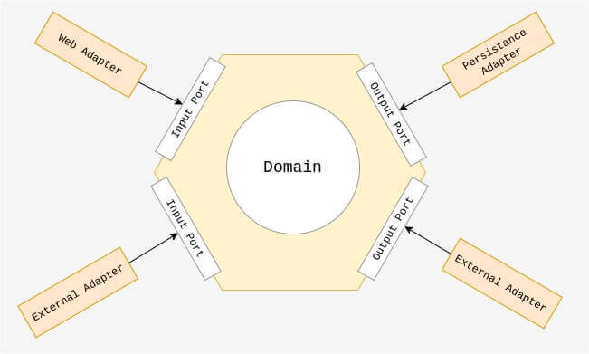

# Architecture Hexagonale (Ports & Adapters)

## Objectifs de cette section

Dans cette section, nous allons explorer **l’Architecture Hexagonale**, qui permet de **séparer complètement la logique
métier des interactions avec l'extérieur** en utilisant le modèle **Ports & Adapters**.  
À la fin de cette section, vous serez capable de :

- Comprendre **les principes fondamentaux de l’Architecture Hexagonale**.
- Identifier les **différences avec les autres architectures**.
- Implémenter une **application backend hexagonale en PHP et Node.js**.
- Analyser les **implications en infrastructure** et organiser le déploiement.

---

## 1. Qu’est-ce que l’Architecture Hexagonale ?

L’**Architecture Hexagonale**, aussi appelée **Ports & Adapters**, a été proposée par **Alistair Cockburn** pour *
*éviter que la logique métier ne soit dépendante d’éléments externes comme la base de données ou le framework utilisé**.

**Son objectif principal :** **Créer un code métier totalement indépendant des technologies utilisées**, en séparant
clairement **les règles métier (Core)** et **les interfaces extérieures (Adapters)**.

### **Principes clés**

- **Séparation stricte** entre la **logique métier** et les **interfaces extérieures**.
- **Utilisation des Ports** pour définir **comment la logique métier interagit avec l’extérieur**.
- **Adaptateurs (Adapters)** pour **connecter la logique métier aux bases de données, API, interfaces utilisateur, etc.
  **
- **Testabilité accrue** car le cœur de l’application peut être testé **sans se soucier des dépendances extérieures**.

**Exemple concret :**  
Une application de gestion de tâches organisée en **Hexagonal Architecture** serait découpée ainsi :

- **Le Domaine (`Core`)** définit ce qu’est une **Tâche** (`Task`) et ses règles.
- **Les Ports (`Ports`)** définissent **comment** interagir avec la logique métier (ajouter une tâche, modifier une
  tâche…).
- **Les Adaptateurs (`Adapters`)** sont des implémentations concrètes des ports pour **connecter la logique métier au
  monde extérieur** (base de données, API, email…).

---

## 2. Différences entre l’Architecture Hexagonale et d’autres modèles

| **Aspect**       | **MVC/N-Tiers**                                                       | **Clean Architecture**                              | **Architecture Hexagonale**                             |
|------------------|-----------------------------------------------------------------------|-----------------------------------------------------|---------------------------------------------------------|
| **Organisation** | Basée sur des couches techniques (Frontend, Backend, Base de données) | Basée sur le métier et les cas d’usage              | Basée sur des **Ports et Adapters**                     |
| **Dépendances**  | La logique métier dépend du framework et de la base de données        | Séparation stricte des couches métier et techniques | **Le domaine est totalement indépendant**               |
| **Évolutivité**  | Changements complexes car tout est lié                                | Plus modulaire et adaptable aux évolutions          | **Facilité d’ajout de nouvelles interfaces**            |
| **Testabilité**  | Tests difficiles car le code métier dépend des technologies           | Bonne testabilité                                   | **Excellente testabilité, isolation du domaine métier** |

---

## 3. Les composants de l’Architecture Hexagonale

L'Architecture Hexagonale est composée de **trois parties principales** :

### **Le Cœur Métier (`Core`)**

- Contient **les Entités** et **les Cas d’Usage**.
- Ne doit **jamais** dépendre de la base de données ou d’un framework !  
  **Exemple** : Un **Service de gestion des tâches** (`TaskService`) qui applique les règles métier.

### **Les Ports (`Ports`)**

- Interfaces définissant **comment** le domaine peut être utilisé.
- Séparés en :
    - **Ports d’entrée (`Input Ports`)** : Interfaces permettant d’appeler la logique métier (**ex: API, CLI,
      WebSockets…**).
    - **Ports de sortie (`Output Ports`)** : Interfaces permettant de **stocker ou récupérer des données** (**ex:
      Repositories, Services externes**).  
      **Exemple** : Une interface `TaskRepositoryInterface` qui définit comment interagir avec les tâches, sans savoir
      si elles sont stockées en SQL, NoSQL ou ailleurs.

### **Les Adaptateurs (`Adapters`)**

- Connectent la logique métier au monde extérieur en **implémentant les Ports**.  
  **Exemple** : Un **Repository** (`TaskRepository`) qui implémente `TaskRepositoryInterface` et utilise **une base de
  données MySQL ou MongoDB**.

**Schéma simplifié de l’Architecture Hexagonale :**  


**Schéma réaliste de l’Architecture Hexagonale :**  


---

## 4. Mise en place d’un backend en Architecture Hexagonale

Nous allons maintenant créer une **application de gestion de tâches** en **suivant les principes de l’Architecture
Hexagonale**.

```bash
/gestion-taches-hexagonale
├── /php                           # Version PHP en Architecture Hexagonale
│   ├── /core                      # Cœur de l’application (Domaine métier)
│   │   ├── Entities/               # Entités Métier
│   │   ├── UseCases/               # Cas d’usage et logique métier
│   │   ├── Ports/                  # Interfaces définies pour les Adapters
│   │   │   ├── Input/              # Interfaces des services côté entrée (ex: API, CLI)
│   │   │   ├── Output/             # Interfaces des services côté sortie (ex: Repositories)
│   ├── /adapters                   # Adaptateurs (Implémentation des Ports)
│   │   ├── Controllers/             # Interface HTTP (API REST, Web)
│   │   ├── Repositories/            # Interaction avec la base de données
│   │   ├── Services/                # Services externes (Email, Notifications…)
│   ├── /infrastructure              # Détails techniques (Base de données, API externes)
│   │   ├── Persistence/              # Implémentation des Repositories
│   │   ├── Config/                   # Configuration et services externes
│   ├── public/                      # Point d’entrée de l’application
│   │   ├── index.php                 # Routeur principal
│   ├── config/                       # Configuration générale
│   ├── database/                     # Scripts SQL et migrations
│   ├── composer.json                  # Dépendances PHP
│   └── README.md                      # Documentation
│
├── /nodejs                         # Version Node.js en Architecture Hexagonale
│   ├── /core                        # Cœur de l’application (Domaine métier)
│   │   ├── entities/                # Entités Métier
│   │   ├── useCases/                # Cas d’usage et logique métier
│   │   ├── ports/                    # Interfaces définies pour les Adapters
│   │   │   ├── input/               # Interfaces des services côté entrée (ex: API, CLI)
│   │   │   ├── output/              # Interfaces des services côté sortie (ex: Repositories)
│   ├── /adapters                    # Adaptateurs (Implémentation des Ports)
│   │   ├── controllers/              # Interface HTTP (API REST, Web)
│   │   ├── repositories/             # Interaction avec la base de données
│   │   ├── services/                 # Services externes (Email, Notifications…)
│   ├── /infrastructure               # Détails techniques (Base de données, API externes)
│   │   ├── persistence/               # Implémentation des Repositories
│   │   ├── config/                    # Configuration et services externes
│   ├── public/                       # Point d’entrée de l’application
│   │   ├── index.js                   # Routeur principal
│   ├── config/                        # Configuration générale
│   ├── database/                      # Scripts SQL et migrations
│   ├── package.json                    # Dépendances Node.js
│   └── README.md                      # Documentation
```

---

## 5. Mise en pratique pour les administrateurs infrastructure

En plus du développement du backend, les administrateurs système devront analyser **l’hébergement et la gestion d’un
backend en Architecture Hexagonale**.

### **5.1. Identification des composants techniques**

**Objectif :** Analyser les besoins d’une architecture **Ports & Adapters**.

- Quels sont les **composants principaux** et leurs responsabilités ?
- Comment garantir que le domaine **reste indépendant des technologies** utilisées ?
- Quels sont les besoins en **stockage et accès aux données** ?

**Livrable attendu** : Un **schéma des composants et de leur interaction avec les bases de données**.

---

### **5.2. Hébergement et gestion des ports et adaptateurs**

**Objectif :** Déterminer **comment héberger et organiser les différents composants**.

- Comment organiser **les adaptateurs et la gestion des entrées/sorties** sur le serveur ?
- Quels outils permettent de **mettre en cache les résultats métier** ?
- Comment structurer **les communications entre ports et adaptateurs** ?

**Livrable attendu** : Un plan détaillé sur **l’hébergement et la répartition des ports/adaptateurs**.

---

### **5.3. Gestion des bases de données et synchronisation**

**Objectif :** Assurer **une gestion efficace et performante des données**.

- Comment garantir que **les ports de sortie ne soient pas liés à une technologie spécifique** ?
- Faut-il **dupliquer les bases de données** pour améliorer la performance ?
- Comment organiser **la réplication et la synchronisation des bases de données** dans un environnement distribué ?

**Livrable attendu** : Une stratégie de **gestion des bases de données et de synchronisation des données**.

---

### **5.4. Sécurisation et monitoring d’une application hexagonale**

**Objectif :** Assurer **la sécurité et la surveillance** d’un backend structuré en Architecture Hexagonale.

- Comment garantir que **les ports d’entrée ne puissent pas être directement exposés** ?
- Quels sont les risques liés à une **architecture trop modulaire** et comment les éviter ?
- Quels outils permettent de **monitorer l’état des services et détecter les erreurs métier** ?

**Livrable attendu** : Une **check-list des bonnes pratiques de sécurité et de monitoring**.
